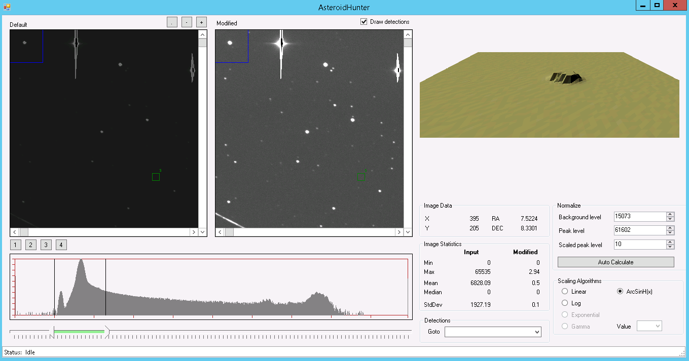

YappySDK
========

As part of the NASA Asteroid Data Hunter TopCoder Challenge, we have had to deep dive into and learn a lot about astronomy. This program opens up a NASA fits file and displays it.

## License

    Copyright 2014 Marius Dornean (MariusSoft LLC) + License included in .cs file

    Licensed under the Apache License, Version 2.0 (the "License");
    you may not use this file except in compliance with the License.
    You may obtain a copy of the License at

       http://www.apache.org/licenses/LICENSE-2.0

    Unless required by applicable law or agreed to in writing, software
    distributed under the License is distributed on an "AS IS" BASIS,
    WITHOUT WARRANTIES OR CONDITIONS OF ANY KIND, either express or implied.
    See the License for the specific language governing permissions and
    limitations under the License.
